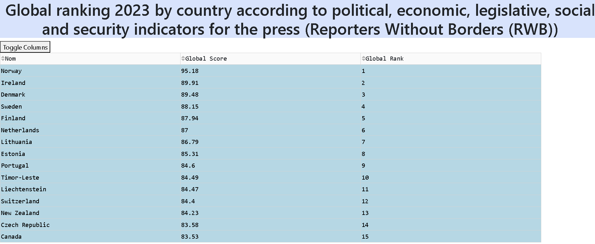
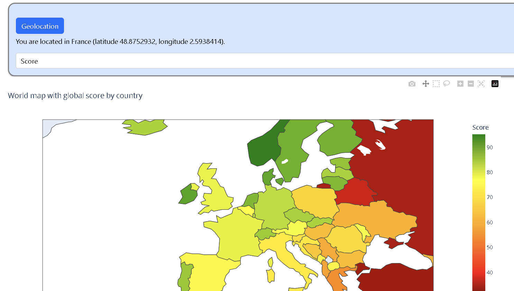
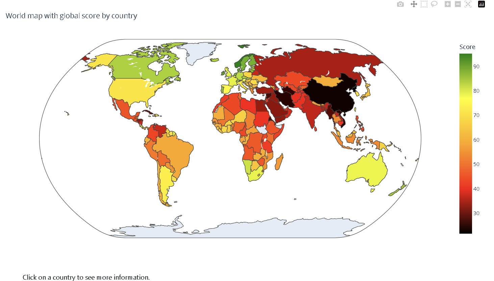

# mini_projet_python

**Mini projet Python :** Classement global 2023 par pays selon les indicateurs politiques, économiques, législatifs, sociaux et de sécurité pour la presse.

Nos données:

Nous avons utilisé plusieurs jeux de données provenant du site Reporters Sans Frontières pour l’année 2023 :
* Score global
* Indicateur politique
* Indicateur économique
* Indicateur législatif
* Indicateur social
* Indicateur sécurité

Les données ont été récupérées au format CSV depuis le site https://rsf.org/fr/classement?year=2023 et stockées dans un fichier CSV disponible dans le dossier “data” de notre projet.

Nous avons également récupéré des données de géolocalisation provenant de l’API Google : https://developers.google.com/public-data/docs/canonical/countries_csv?hl=en

**User guide :**

Nous avons utilisé la version 3.11 de Python pour réaliser ce projet.

Il faut installer certains modules Python : plotly, dash, pandas, geopy, bs4.

Pour installer un module, utilisez la commande `pip install [module]`dans votre terminal. Pour mettre à jour un module déjà installé, utilisez la commande `pip install [module] --upgrade pip`.

Après avoir fait tout cela, vous pourrez récupérer notre projet. Pour ce faire, copiez le projet en le clonant sur git ou en le téléchargeant au format .zip (n’oubliez pas de le décompresser si vous le téléchargez). Ensuite, allez sur votre terminal, ouvrez le fichier contenant le projet puis exécutez le projet via la commande : `python main.py`. Après avoir tapé la commande, un lien comme celui-ci apparaîtra : http://127.0.0.1:8050/ , il faudra donc cliquer dessus. Ce lien vous redirigera vers le tableau de bord de notre projet.

**Developer guide :**

Pour installer Dash : `pip install dash`, pour installer pandas : `pip install pandas`, pour installer Plotly : `pip install plotly`, pour installer geopy : `pip install geopy`, pour installer bs4 : `pip install beautifulsoup4`.

N’oubliez pas de faire les mises à jour des modules !

Après avoir fait cela, on pourra procéder à la création de notre code en suivant les étapes suivantes :
* *1ère étape :* Il faut faire tous les imports nécessaires (import dash, from dash import dcc, from dash import html, from dash import dash_table, import io, from geopy.geocoders import Nominatim, from dash.dependencies import Input, Output, import csv, import pandas as pd, import requests, from bs4 import BeautifulSoup, import plotly.express as px, import plotly.graph_objs as go, from plotly.subplots import make_subplots);
* *2ème étape :* Création d’une fonction pour récupérer et stocker les coordonnées GPS de tous les pays dans un fichier CSV. Nous allons aussi mettre le lien contenant les informations sur les pays en faisant ensuite appel à la fonction pour récupérer les coordonnées des pays et les stocker dans un fichier CSV et enfin procéder à la lecture du fichier CSV contenant les coordonnées des pays;
* *3ème étape :* Nous allons nous intéresser à nos données principales qui concernent notre étude en procédant à la lecture du fichier CSV contenant le classement global des pays selon plusieurs critères pour 2023, en réalisant l’affichage des colonnes et des options pour la liste déroulante. Nous allons également procéder à la fusion des données de coordonnées et du classement des pays;
* *4ème étape :* Initialisation de l’application Dash en réalisant un Callback pour mettre à jour la carte du monde en fonction de la sélection (Échelles de couleurs pour chaque variable, titres pour chaque variable, création de la carte, gestion du zoom), mise en place de la géolocalisation, on va aussi faire un Callback pour mettre à jour les informations sur le pays sélectionné, un autre Callback pour mettre à jour la géolocalisation en temps réel et un dernier Callback pour afficher les informations de géolocalisation;
* *5ème étape :* Configuration de l’application avec ajout d’un style CSS et mise en page de l’application;
* *6ème et dernière étape :* Lancez la commande python main.py, cliquez sur le lien http://127.0.0.1:8050/ qui vous enverra sur le tableau de bord.

*Plus d’informations :*
* https://dash.plotly.com/
* https://plotly.com/python/
* https://pandas.pydata.org/docs/
* https://geopy.readthedocs.io/en/stable/

**Rapport d’étude :**

Notre étude porte sur le classement global de la liberté de la presse 2023 par pays selon les indicateurs politiques, économiques, législatifs, sociaux et de sécurité pour la presse. Un classement réalisé par Reporters Sans Frontières.

D’abord, explication du fonctionnement de notre tableau de bord.

Ci-dessous, on peut voir une partie du tableau qui affiche le score global. Les données sont récoltées sur 180 pays.

En cliquant sur le bouton “Géolocalisation”, on zoome sur notre pays. 

Ici, on peut visualiser la carte. 

Vous pouvez gérer le zoom à l’aide de ceci qui apparaît en dirigeant la souris sur la carte.

Sur notre carte, on peut également choisir d’autres indicateurs.

Quand on clique sur un pays, on a des informations concernant l’indicateur choisi.

Maintenant, on va pouvoir se concentrer sur notre étude :

Au début de notre tableau on constate que sur les 15 premiers pays, 12 pays sont situés en Europe.

